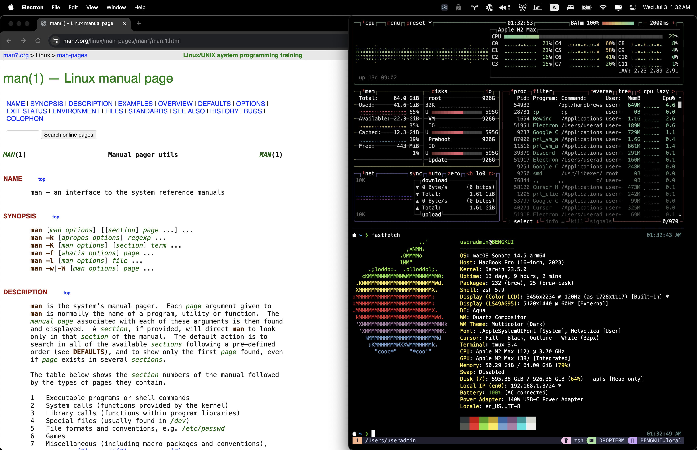

# dropterm

Inspired by the classc drop-down terminals on Linux like Guake. Super simple Electron + Xterm.js based terminal. Only tested on macOS.

- Toggle visibility by pressing `Command+Shift+/`. 
- Terminal window coverts full right half of the screen.
- Opens a new tmux session on startup called "DROPTERM"
- OSC52 support (copy from tmux). 


> [!NOTE]
> This project contains several hardcoded elements and was primarily developed for personal use. Customization options will be added in future updates. Currently, it requires MesloLGS NF font, tmux, and zsh to be installed.

## Screenshot



## Recommended IDE Setup

- [VSCode](https://code.visualstudio.com/) + [ESLint](https://marketplace.visualstudio.com/items?itemName=dbaeumer.vscode-eslint) + [Prettier](https://marketplace.visualstudio.com/items?itemName=esbenp.prettier-vscode)

## Project Setup

### Install

```bash
$ npm install
```

### Development

```bash
$ npm run dev
```

### Build

```bash
# For windows
$ npm run build:win

# For macOS
$ npm run build:mac

# For Linux
$ npm run build:linux
```
